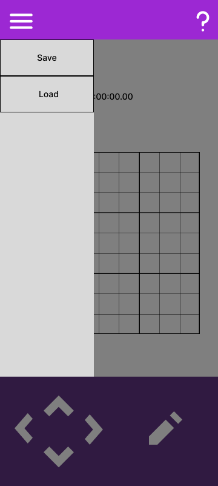
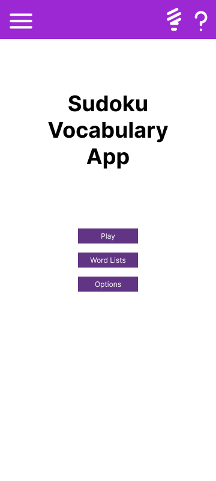
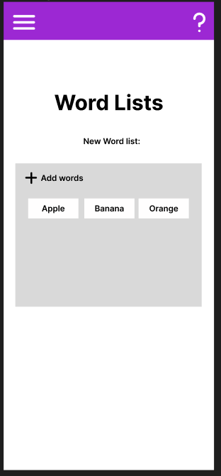
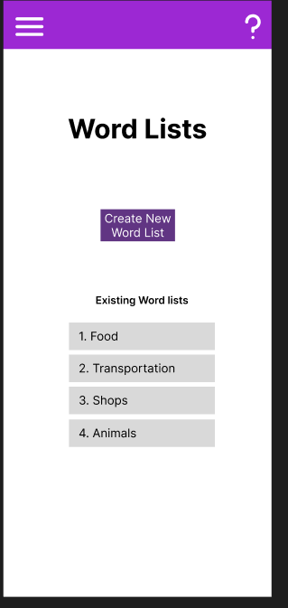

# User Stories

### Novice Users:
- As a novice user, I want to be able to access a help page so that I can reference it when I don't 
  remember how to use the app.

### Expert Users:
- As an expert user, I want to be able to save/load a game in progress so
  so that I can stop and resume playing at my own convenience.

  - Example:
    - Initial screen:
      
      
    
    - When 'save' button is pressed, current game state is saved and can be loaded 
     by pressing the adjacent 'load' button.

- As an expert user, I would like to be able to switch the look of the 
  application between light and dark themes so that I have a better
  time using the application in different lighting conditions.

  - Example:
    - Initial screen: 
    
      
      
    - When light bulb button on top toolbar is clicked, background colour should
      should switch to black/dark grey and black title text should also
      change to the colour white.

### Language Learners:

- As an expert language learner, I want to be able to create my own vocabulary lists
  so that I can practice specific words of my choosing.

### Language Teachers:
- As a language teacher, I want to be able to choose the words that were taught this week to reinforce the learning.

  - For example, when the user clicks on "create new word list" the user can add new words by typing in the word they want to include in the list. They can add multiple words in a list and create multiple lists.
    

- As a language teacher, I want a pronunciation feature for the words so my students could learn how to say it.
  
  - For example, when the user goes to translate the word, there is a volume button which signifies that they can click on the button to learn how to pronounce the current word they are translating. This way not only do they practice their writing skill, they can also learn to recognize the word when it is spoken out loud.
    

- As a language teacher, I want to be able navigate back to the history of wordlists ive created so I can use them for future cohorts of students.
  - For example, on the word list page, the user can either create a new word list, or view previous word lists that have been created so that it could be used for future students.
    
