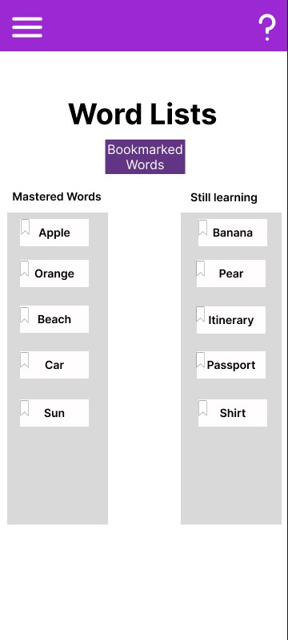
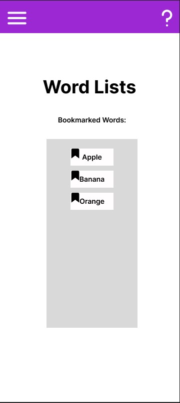
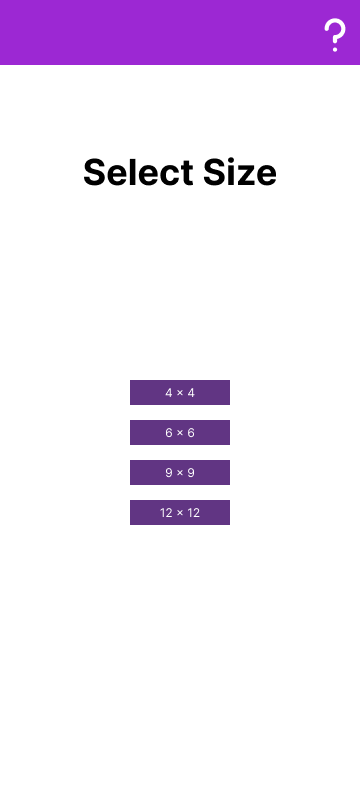
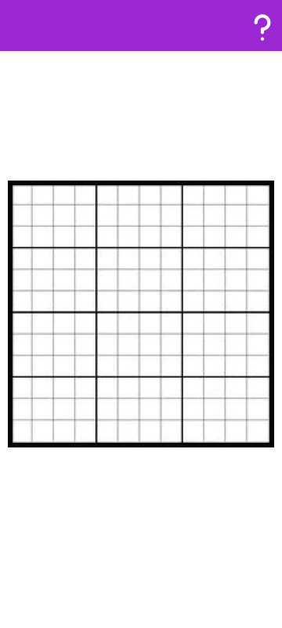
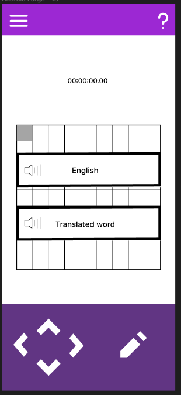
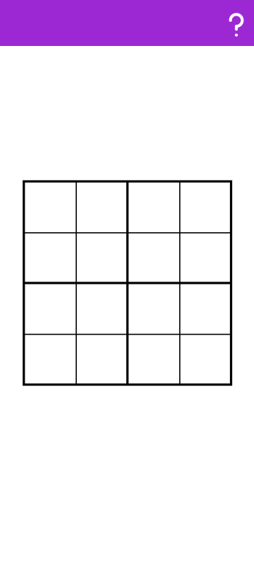
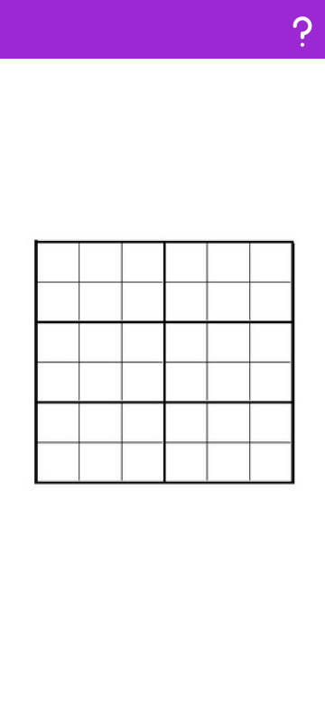

# User Stories

### Novice Users:
- As a novice user, I want to be able to access a help page so that I can reference it when I don't 
  remember how to use the app.

  - Example:
    - The 'question mark' symbol will always be on the top right of the app.

    - When the 'question mark' symbol is clicked, a new menu pops up and displays helpful tips
      and tutorials on how to play and navigate through the app.

- As a novice user, I would like there to be a hint button so that I can progress without being stuck on words.

  - Example:
    - If the user is stuck or not progressing in their sudoku game, they can press the "hint" button
      that can give them the direct translation of a random word in the word list being used.

    - The number of hints available will vary depending on the difficulty of the game (easy, medium, hard).

- As a novice user, I want to be able to access the word bank so that I can study and 
  review the words before I play the game.

  - Example:
    - On the main menu of the app, there is a 'Word List' button. If pressed, it takes the user 
      to a new menu of which there is another 'Practice' button.
    
    - When the user presses the 'Practice' button, the user can view all the native words
      and their respective translation of the language being learned.

- As a novice user, I want there to be a stopwatch timer so that I can see how long it takes for me to solve the sudoku.

  - Example: 
    - When a user starts a sudoku game of any difficulty, a timer (counting upwards from zero) 
      is displayed on the screen. When the user finishes the sudoku game, the timer stops.
    
    - The sudoku vocabulary app will keep track of the user's best times.

### Expert Users:
- As an expert user, I want to be able to save/load a game in progress so
  so that I can stop and resume playing at my own convenience.

  - Example:
    - Initial screen:
      
      
    
    - When 'save' button is pressed, current game state is saved and can be loaded 
     by pressing the adjacent 'load' button.

- As an expert user, I would like to be able to switch the look of the 
  application between light and dark themes so that I have a better
  time using the application in different lighting conditions.

  - Example:
    - Initial screen: 
    
      
      
    - When light bulb button on top toolbar is clicked, background colour should
      should switch to black/dark grey and black title text should also
      change to the colour white.

### Language Learners:

- As a expert language learner, I want many categories of words such as foods, animals, travel, to choose from so that I can improve my vocabulary in chunks and become faster at categorizing the vocabulary.

- As a beginner language learner, I want a list of vocabulary words that I keep getting wrong so that I can focus more on the mistaken words to improve my knowledge. 
  - For example, the app will keep track of mistaken words in the "still learning" category, and words that the user gets correct frequently in the "mastered" category.
  
    

- As a medium language learner, I want the option of having a "favourite" option for the vocabulary words
so that I can refer back to it. For example, clicking the unfilled in bookmark beside the word will put it into the bookmarked words page.

  

- As a vocabulary learner who wants an extra challenging mode, I want a 12x12 version of Sudoku to play on my tablet. The overall grid should be divided into rectangles of 12 cells each (3x4).
  - For example, when the user presses the 12x12 button in the size menu before the game, the app 
    should display a Sudoku grid that is 12 cells wide and 12 cells tall. Additionally, the entire 
    grid should be split into 3x4 sub-grids, or a height of 3 cells and a width of 4 cells.

    
    

### Language Teachers:
- As a language teacher, I want to be able to choose the words that were taught this week to reinforce the learning.

  - For example, when the user clicks on "create new word list" the user can add new words by typing in the word they want to include in the list. They can add multiple words in a list and create multiple lists.
   
    

- As a language teacher, I want a pronunciation feature for the words so my students could learn how to say it.
  
  - For example, when the user goes to translate the word, there is a volume button which signifies that they can click on the button to learn how to pronounce the current word they are translating. This way not only do they practice their writing skill, they can also learn to recognize the word when it is spoken out loud.

    

- As a language teacher, I want to be able navigate back to the history of wordlists ive created so I can use them for future cohorts of students.
  - For example, on the word list page, the user can either create a new word list, or view previous word lists that have been created so that it could be used for future students.
  
    
  

- As a teacher of elementary and junior high school children, I want scaled versions of Sudoku that use 4x4 and 6x6 grids. In the 6x6 grid version, the overall grid should be divided into rectangles of six cells each (2x3).
  - Before the game starts the user should be able to select which sized Sudoku grid 
    they wish to play with.
   
    

  - For example, when the 4x4 button is pressed, the app should launch into a Sudoku game with 
    a 4x4 grid with 2x2 sub-grids as shown below.
   
    
  
  - For example, when the 6x6 button is pressed, the app should launch into a Sudoku game with
    a 6x6 grid with 2x3 sub-grids as shown below.
   
    

