**TDD EXAMPLES** 
**Listening comprehension mode:** 
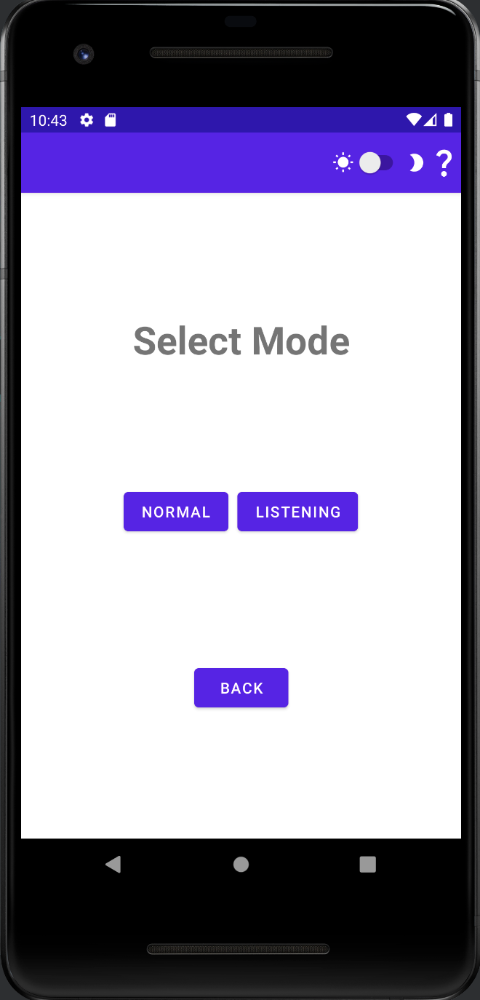 
This is the UI for activating the listening mode. To play the listening mode, click the listening button.   
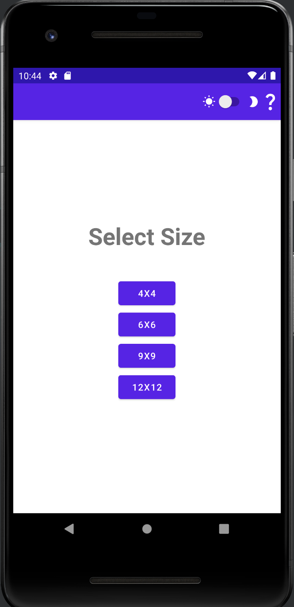 
After clicking the listening button, the user has the option to choose the board size. (4x4,6x6,9x9,12x12), let's choose the 6x6 option   
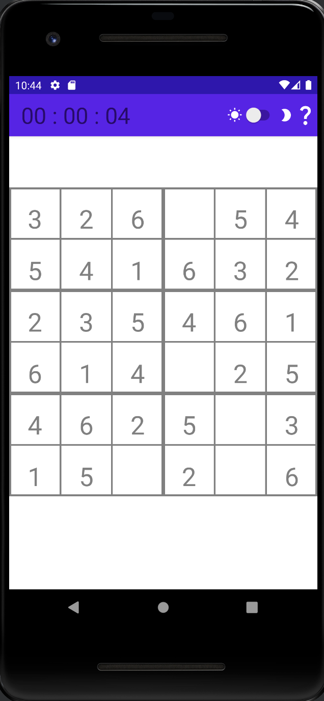 
After clicking the 6x6 button, this is what the board will look like.   
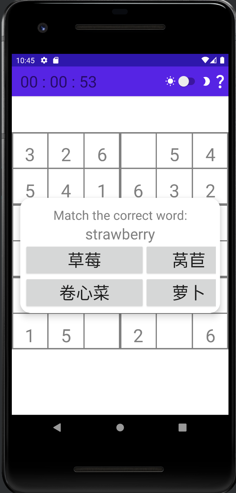 
If the user were to click on an empty cell , they will be prompted with this pop up. An audio queue of the word will play and it is the users turn now to choose the right word.   
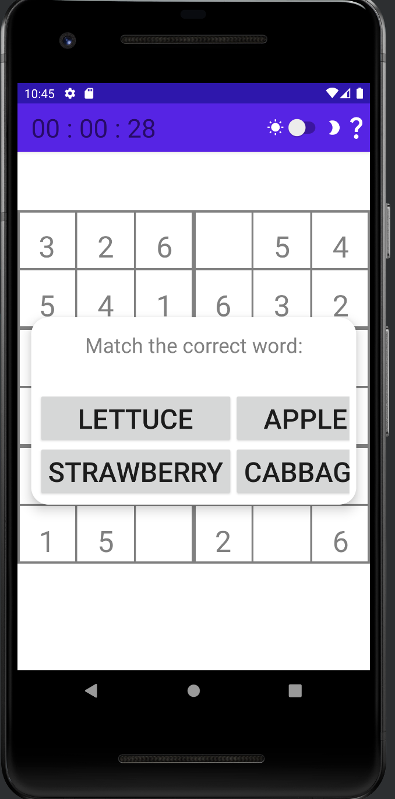 
if the user were to click on a number, they will again be prompted with a popup and an audio queue. Again it is now the users turn to listen and click the right translation.
**Updating for full functionality of your application:** 
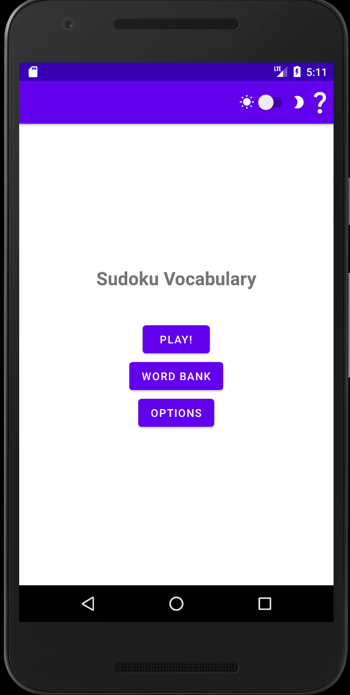 
This is the main menu of our game. Now lets click play!   
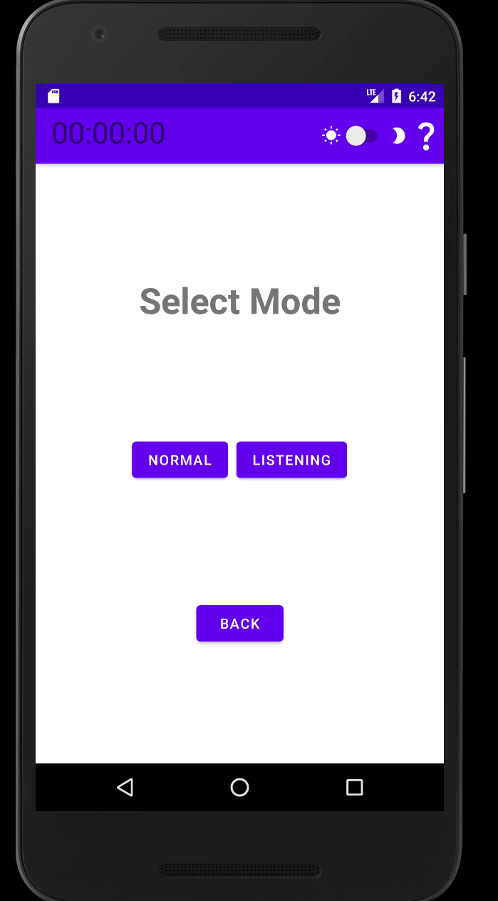 
The user will be prompted with choosing a normal mode and listening mode. Normal mode will be your regular sudoku playthrough, but choosing when choosing listening mode, whenever the user clicks an empty cell, it will display the word and an audio queue of the word will play.  
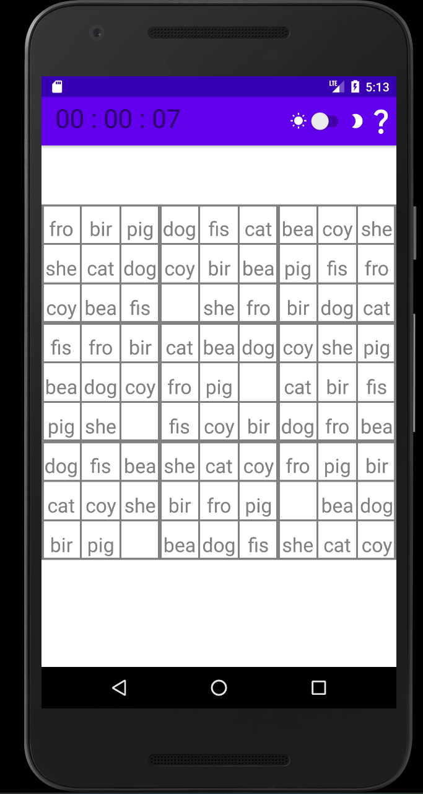 
This is how the game looks empty. To insert words, click on the empty cells  
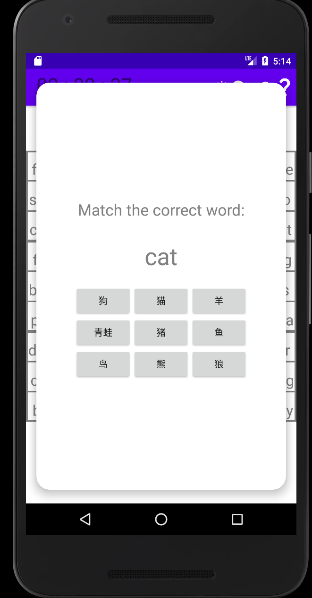 
After clicking on an empty cell, the user is prompted with with the word in english. It is now the users job to click the corresponding translation given from the words  
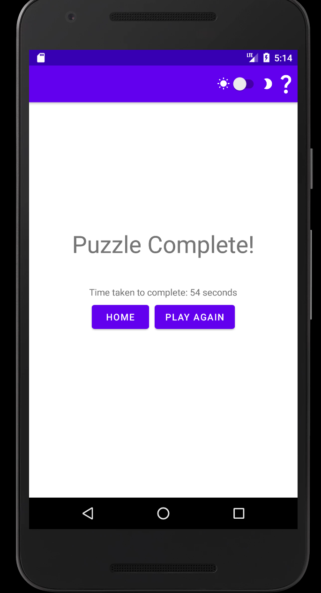 
After the user has managed to complete the sudoku board, this will be the winning screen. It will display the time and options to replay or go back to the main menu  
 
Going back to the main menu and clicking word bank will promt the user this new activity. The user has an option to click create new word list or click on a pre created word list.   
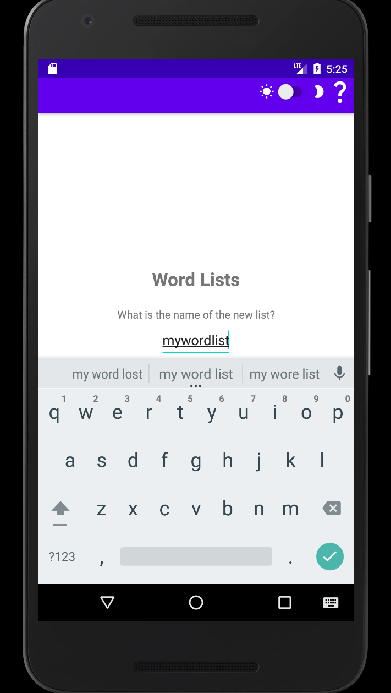 
This activity starts when clicking on the create new word list option. The user will prompted to name the newly created word list. 
 
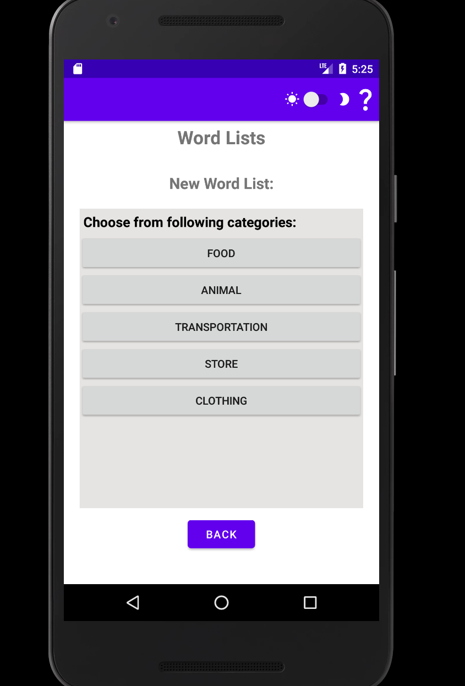 
The user can now choose their words from the given categories. Lets pretend the user chooses to choose four words.  
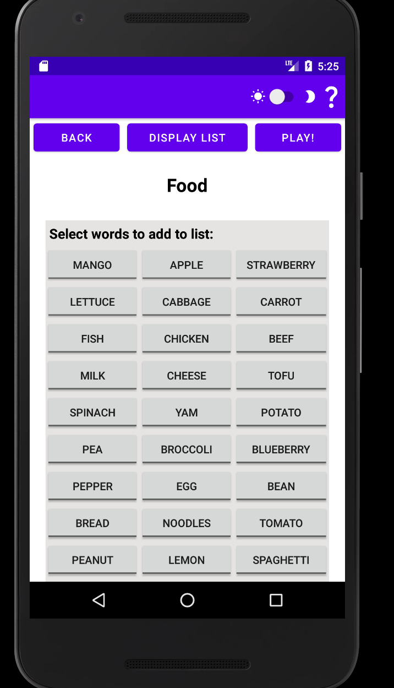 
The food list words.  
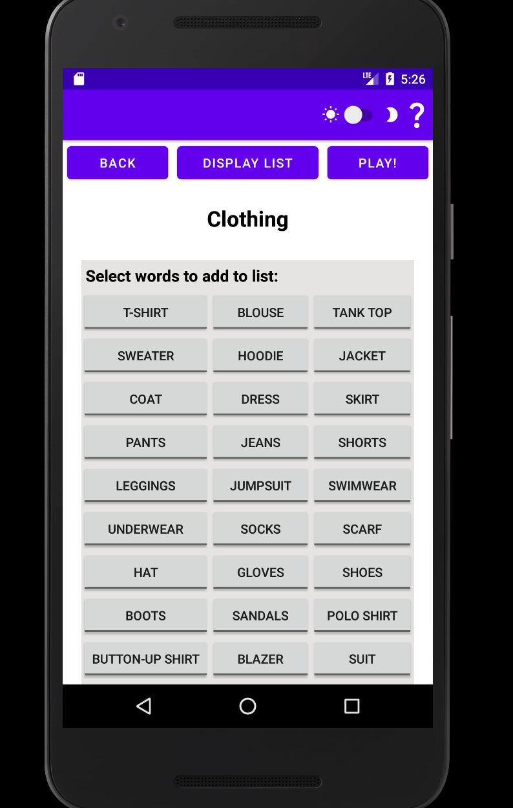 
The clothing list words.  
 
The food category list words.  
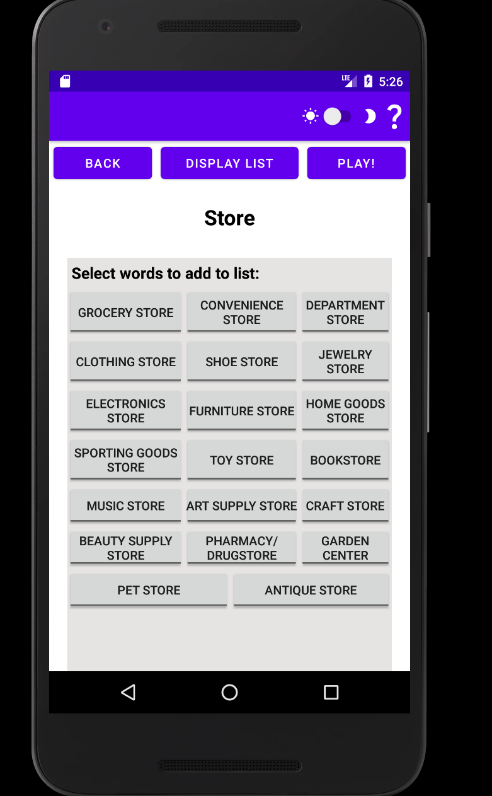 
The store category list words.  
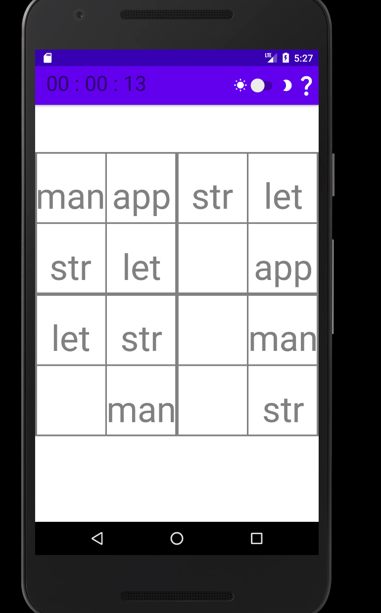 
This is the board for the chosen 4 words.  
 
This is the dark mode feature when clicking the moon in the top right corner.  
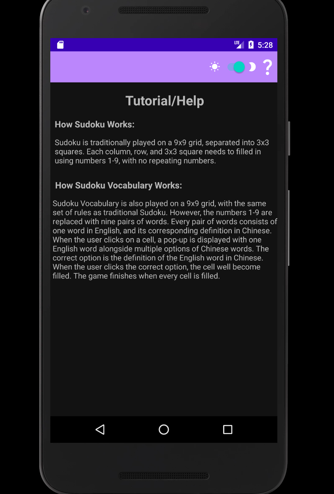 
When the user clicks the ? icon in the top right corner, it will give an overview of regular sudoku is played and how our language learning sudoku plays.   
